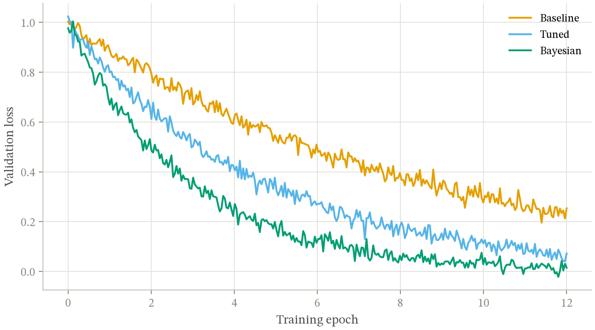

# figure-gate

Mechanical gates for figures that go into documents — papers, slides, theses,
reports. Two validators and a matplotlib style sheet, plus a written guide, and
an [Agent Skill](https://code.claude.com/docs/en/skills) wrapper so Claude Code
applies the same method.

The premise: a figure can be correct, legible and colorblind-safe and still be
bad, but it can't be good while failing any of those. Those three are
checkable, so check them instead of squinting.

```bash
python check_palette.py "#E69F00,#56B4E9,#009E73" --pairs all
python check_figure.py              # self-test on a deliberately broken figure
```



*(`python examples/demo.py` — the whole method in 40 lines.)*

## What it catches

**`check_palette.py`** — standard library only, takes hex strings, so it works
from any language or toolchain.

| Gate | Fails when |
|---|---|
| Lightness band | a hue is too light or too dark to read as a mark |
| Chroma floor | a "color" is effectively gray |
| CVD separation | two hues collapse under protanopia or deuteranopia |
| Normal-vision floor | two hues are hard to tell apart even in full color |
| Contrast vs surface | a hue is under 3:1 on the page *(advisory)* |
| Ordinal: monotone, even steps, light end | an ordered ramp reads as unordered |

**`check_figure.py`** — reads a built matplotlib figure's own artists.

| Gate | Fails when |
|---|---|
| Clipping | text runs past the canvas |
| Text collision | two labels overlap |
| Contrast stack | nothing is opaque, or transparency has too many levels |
| Mark ratio | one mark is so large it reads as ornament |
| Axis redundancy | panels on a shared scale repeat their axis furniture |
| Type size | a string lands under 7.5pt *on the printed page* |
| Ink coverage | a panel is empty or saturated *(advisory)* |

The type gate is the one people are usually surprised by. A figure authored at
14 inches and placed on a 750pt slide shrinks to 0.74×, so a 9pt label arrives
at 6.7pt — fine on your monitor, unreadable from the back of a lecture hall.
The check derives the scale per figure and measures what actually renders, so
sizes set through rcParams or by a helper are caught too.

## Install

Nothing to install. Copy three files into your project:

```bash
git clone https://github.com/narenp12/figure-gate
cp figure-gate/skill/assets/figure.mplstyle       your-project/diagrams/
cp figure-gate/skill/scripts/check_palette.py     your-project/diagrams/
cp figure-gate/skill/scripts/check_figure.py      your-project/diagrams/
```

Then set two things and nothing else:

1. `font.serif` in `figure.mplstyle` → your document's body typeface.
2. `CONTENT_WIDTH_PT` at the top of `check_figure.py` → the usable width, in
   points, of the page the figure lands in. Leave it `None` if you author each
   figure at the width it's placed at, which makes the scale 1.0 and the whole
   calculation disappear.

### As a Claude Code skill

```bash
cp -r figure-gate/skill ~/.claude/skills/research-figures
```

Claude then applies the method when you ask for a figure for a paper or deck.
`skill/SKILL.md` is the workflow; `skill/references/style-guide.md` is the
reasoning behind every threshold.

## Use it

```python
from pathlib import Path
import matplotlib.pyplot as plt
from matplotlib import colormaps

plt.style.use(str(Path(__file__).parent / "figure.mplstyle"))

okabe = colormaps["okabe_ito"]          # matplotlib >= 3.11
fig, ax = plt.subplots(figsize=(7, 4), constrained_layout=True)
ax.plot(x, y, color=okabe(1), lw=1.6, label="Baseline")

from check_figure import report
report(fig, "my-figure")
```

Resolve the style sheet relative to the *file*, not the working directory —
`plt.style.use("figure.mplstyle")` breaks the moment a test runner or build
script invokes it from elsewhere.

Wire it into your build so a broken figure fails CI:

```python
@pytest.mark.parametrize("name", sorted(FIGURES))
def test_figure_is_composed(name):
    ok, rows = audit(build(name))
    assert ok, "\n".join(f"{k}: {d}" for k, s, d in rows if not s)
```

## What it doesn't do

It won't tell you the figure is worth making. Every check here is an
*elimination* gate — each forbids one enumerated failure, and none of them ever
looks at the figure as a whole. A figure that passes has been judged not-bad in
exactly the ways someone thought to write down, which is not the same as good.
Render a PNG and look at it. The checker can't see that an arrow points at the
wrong thing, that reading order runs backwards, or that a label is true of the
concept and false of the curve beside it.

It also isn't for interactive web charts. Dashboards have different constraints
(hover, responsive reflow, dark mode) and most of the rules here don't transfer.

## Design notes

**Use what matplotlib ships.** viridis for sequential, `RdBu` for diverging,
`okabe_ito` for categorical, style sheets for defaults, `constrained_layout` for
layout. Earlier versions of this hand-rolled all four and every one was worse.
`RdBu`'s poles clear every gate in `check_palette.py` unmodified; a windowed
custom ramp threw away 35% of viridis for no benefit.

**WARN is not FAIL.** A sub-3:1 hue is legal if it carries a direct label; a
heatmap panel legitimately measures 0.98 ink coverage. Failing those would train
everyone to ignore the row, and a gate people learn to skip is worse than no
gate.

**Gates get tested for their ability to fail.** `tests/` asserts that each check
catches a figure with exactly that one defect, and that the style sheet's colors
actually apply. That last one exists because `#` starts a comment in matplotlib's
style format, so `grid.color: #e1e0d9` silently parses as empty and matplotlib
keeps its defaults — with every other test still green.

The full reasoning, including the measurements behind each threshold and the
rules that were tried and reverted, is in
[`skill/references/style-guide.md`](skill/references/style-guide.md).

## Requirements

- `check_palette.py` — Python 3.8+, standard library only. Tested on 3.8–3.13.
- `check_figure.py` — Python 3.9+, matplotlib 3.8+.
- `colormaps["okabe_ito"]` needs matplotlib 3.11+. On older versions the
  palette is eight hex strings; they're listed in the style guide.

## Contributing

New gates are welcome, and the bar is the one the project holds itself to: a
gate ships with a test proving it fails on a figure with that defect, and a note
naming the real failure that motivated it. See
[CONTRIBUTING.md](CONTRIBUTING.md).

## License

MIT — see [LICENSE](LICENSE).
