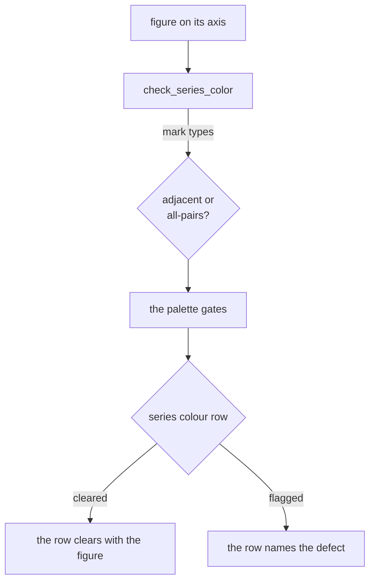

# How the checkers decide

This page explains how figure-gate reaches a verdict, what evidence stands
behind the thresholds, and what a passing run does not tell you.

It is background reading. For what each row measures, see
[The gates](gates.md). For what to type, see
[the how-to guides](how-to.md).

## Every check is an elimination gate

Each check forbids one enumerated failure. None of them looks at the figure as a
whole.

21 passing rows means the figure avoids 21 named defects. It does not mean the
figure is good. The checker cannot see an arrow pointing at the wrong object, a
reading order that runs backwards, or a label that is true of the concept and
false of the curve beside it.

Render the figure and look at it.

## Why there are two checkers

A figure on matplotlib's default `tab10` cycle, with a `twinx` second axis,
returned nothing but passing rows from the composition checks. `check_palette.py`
rated that same cycle's orange and green at dE 2.4 under protanopia: one hue to
that reader, against a floor of 10.5. The composition checker had no access to
the colors it was drawing.

`check_series_color` closes that gap. It reads the hues off the figure's own
artists, decides from the mark types whether the figure needs adjacent
separation (lines, bars) or all-pairs separation (scatter), and runs them through
the palette gates. That is row 12 of the 21.

The two checkers stay separate files because their contracts differ.
`check_palette.py` takes hex strings and imports nothing outside the standard
library, so a non-Python toolchain can gate a palette without a Python
interpreter on PATH. `check_figure.py` renders a matplotlib figure, which is a
Python object by definition. The figure checker imports the palette checker,
never the other way around.

## Measurement happens on the printed page

Type size and line weight are measured where the figure prints, not on the
canvas you drew it on.

A figure authored at 14 inches (1008pt) and placed on a 750pt slide renders at
750/1008 = 0.74x. A 9pt label arrives at 6.7pt, under the 7.5pt floor, and under
it by an amount nobody notices on a monitor. `page_scale` derives that ratio per
figure, so sizes set through rcParams or by a helper are caught along with the
ones set inline.

Placing at a fraction of the content width changes the ratio again.
`audit(fig, placed_frac=0.48)` mirrors `\includegraphics[width=0.48\textwidth]`.
Without it, a half-width figure is certified at twice the type size it ships at.

## How label attribution tells a band from a rival

Label attribution reads filled regions as series. A filled region holding at
least `SERIES_ENCLOSED_FRAC = 0.7` of another series' ink is treated as that
series' band rather than as a rival for its label.

The rule exists because a confidence band lies on top of the curve it belongs
to. Without it, every direct label under a band ties with its own curve at zero
distance and fails.

The floor separates two measured shapes. Adjacent `stackplot` bands share a
dividing edge and read at most 43.9% of each other over 200 random figures. A
`fill_between` band drawn over its curve's whole range reads 100.0%. A band
covering only part of its curve reads in proportion: 88.1% over nine tenths of
the range, 48.3% over half. Below the floor, it goes back to competing with the
curve it belongs to.

## What a passing run does not mean

**A row can be reporting the checker rather than the figure.** Every gate runs
inside its own exception handler. A gate that raises keeps its row and puts the
exception in the detail, marked as a defect in the checker rather than in the
figure. It takes its own severity: an advisory that crashed warns, a hard gate
that crashed fails, because a gate that measured nothing has not cleared the
figure.

No gate is known to raise. Twenty adversarial figures, including 3D, polar,
all-NaN, infinite, and zero-sized ones, found none. The handler is there anyway,
because these gates read matplotlib internals that are free to move.

**Two blind spots remain, because a passing row looks the same as an absent
one.** The colormap gate reads a `Colormap`'s name to tell an encoding from a
hand-set list of colors, so a map matplotlib left unnamed is skipped rather than
judged. It also needs `check_palette.py` importable beside it; without that, the
row reports that it classified nothing, and passes. Both are deliberate.

**The rules do not transfer to interactive web charts**, where hover, responsive
reflow, and dark mode change most of the constraints.

## What the evidence is

The colour gates answer to an independent implementation.
`tests/test_colour_space_oracle.py` runs this project's CIECAM02 against
colorspacious, and runs the whole accept-or-reject decision against the same,
asserting specificity above 0.95. The OKLab metric this replaced in 0.8.0
measured 0.786 at its shipped operating point.

The composition gates have no equivalent oracle, because there is no importable
corpus of published figures: journals ship PDFs, not `Figure` objects. The
nearest external material is matplotlib's own 28 shipped style sheets, and
`tests/test_external_style_corpus.py` runs three neutral figures under every one
of them. Four of those styles are published by their authors as accessible under
colour vision deficiency. The colour gate rejects none of those four, and
rejects 21 of the 24 that make no such claim.

The same sweep names what does *not* discriminate, which is the more useful half.
`check_style_sheet` and `check_fonts` fire on 28 styles out of 28. The first asks
whether this project's sheet is in effect, and the second asks for Type 42
embedding; on anyone else's sheet both answers are known in advance. Both rows
are advisory, and neither is evidence of anything about a figure.

## What the API promises

The public API is every name without a leading underscore in `check_figure.py`,
`check_palette.py`, and `suggest_fixes.py`. That is broader than the handful you
would guess, and it is deliberately the same set the release gate compares, so
the statement and the enforcement cannot drift apart.

Below 1.0, a minor release may break it. No change reaches `main` whose
`## Unreleased` section fails to name what moved: CI runs
[`audit_api.py`](https://github.com/narenp12/figure-gate/blob/main/skill/scripts/audit_api.py)
against the last tag on every pull request, and a symbol that changed without
being written down fails the build.

What is not enforced is the sentence rather than the symbol. The gate checks
that a changed name appears in `## Unreleased` next to a word admitting a
change. It cannot check that the sentence describes the change accurately.

For the version table, see [Compatibility](compatibility.md).

## Design decisions

???+ note "Use what matplotlib ships"

    viridis for sequential, `RdBu` for diverging, `okabe_ito` for categorical,
    style sheets for defaults, `constrained_layout` for layout. Earlier versions
    hand-rolled all four and each was worse: `RdBu`'s poles clear every gate in
    `check_palette.py` unmodified, and a windowed custom ramp discarded 35% of
    viridis for no measured gain.

???+ note "Pixels are measured at one resolution, `MEASURE_DPI = 150`"

    Roughly half the thresholds are pixel counts: the edge window the
    readability gate uses to tell a mark from ground, the footprint below which
    a text box is a glyph or two, the distance from the page colour at which a
    pixel counts as ink. A pixel count is a measurement only if the resolution
    is fixed.

    `figure.dpi` is not fixed. It is an author's knob, it is whatever sheet is
    in effect, and a GUI backend multiplies it by the display's device pixel
    ratio without asking. So `audit` draws at `MEASURE_DPI` whatever the figure
    was authored at, and hands the figure back on the dpi it arrived on.

    The cost of not doing this was measured before the constant existed. Across
    100, 150, 200, 300, and 600 dpi, the eleven gallery figures moved 34 rows
    and flipped one. The same figure, five verdicts, from a knob that has
    nothing to do with whether it reads. `savefig.dpi` is unaffected, so what
    you write out is still yours to choose.

???+ note "WARN is not FAIL"

    Eight of the 21 rows are advisory: they can return `"warn"` but never
    `False`. A sub-3:1 hue is legal when it carries a direct label, and a
    heatmap panel legitimately measures 0.98 ink coverage. Failing those would
    train people to ignore the row.

    Type size is the one row that does both. It fails under the floor, and warns
    on a figure placed under 35% of the content width.

???+ note "A detail string carries two marks, and they mean different things"

    `[FIX]` introduces an action, and nothing else is allowed to wear it.
    `[WHY]` introduces the reason the row fired.

    The two marks were once one mark, an arrow, which said nothing about which
    of the two things followed it. Six clauses wore it while naming only why:
    `check_banking` cited Cleveland, `check_line_weight` cited SIAM, and neither
    told anyone what to change. Splitting an arrow against a tilde would have
    put the whole distinction on one glyph in a wall of detail text, so the
    marks are words.

???+ note "Gates are tested for their ability to fail"

    The suite is 1833 tests, and each check has one asserting it catches a
    figure with exactly that defect. The style sheet has its own tests because
    `#` starts a comment in matplotlib's style format: `grid.color: #e1e0d9`
    parses as an empty value, matplotlib keeps its default, and every other test
    stays green.

## History: the backend used to change the answer

You do not have to set the backend for the numbers to come out right. The
checker normalises for this itself. It did not always.

A HiDPI GUI backend, macosx on a Retina display or Qt on a scaled desktop, sets
`fig.dpi` to the authored dpi times the display's device pixel ratio at the
moment the figure is created. A figure built under one arrived at the checker at
2x. Through 0.1.1 that meant two wrong answers at once. Text extents come back in
physical pixels while the canvas reports its width in logical ones, so the
clipping gate compared 2x coordinates against a 1x bound and failed labels that
fit. Thresholds calibrated in pixels covered half the distance they were
calibrated for. The same figure passed under Agg and failed under macosx.

Since 0.1.2 the checker measures on Agg regardless of what the figure was built
under, so the verdict is a property of the figure rather than of the display.
0.8.0 finished the job: the display's pixel ratio was only ever the loud case of
a pixel threshold read against a resolution nobody had pinned, so the canvas is
now drawn at `MEASURE_DPI = 150`. Setting `figure.dpi` yourself no longer moves a
verdict either.

The bug never reached CI. Every test and every example pins Agg, so nothing in
the suite could construct the failing condition, and it stayed green across a
release.

One consequence is unchanged and still worth knowing: an audited figure is no
longer attached to its GUI canvas and will not show in a window. Audit last, or
audit a figure you rebuild for the purpose.

## Further reading

- [The figure style guide](style-guide.md) for the measurement behind each
  threshold, and the rules that were tried and reverted.
- [Choosing a form](choosing-a-form.md) for the decision no styling rule
  rescues. Only its mechanical subset is gated: a script can rule out a pie or a
  truncated bar baseline, but it cannot tell you a box plot is hiding an n of 8.
- [The gallery](gallery.md) for nineteen audited figures, and the defects that
  writing them exposed in the checks.
