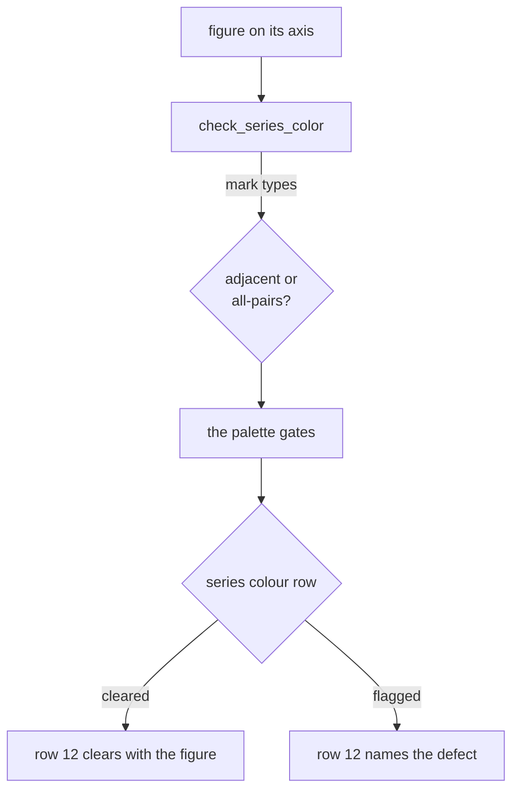

# The gates

`audit(fig)` returns `(ok, rows)`, one row per gate. `check(colors)` gates a
palette the same way. This page is what each row measures and the threshold it
measures against. [The style guide](style-guide.md) is the measurement behind
each threshold. [The how-to](how-to.md) is what to type when a row fails.
[The design](design.md) is why the two checkers talk to each other and what a
passing run does not mean.

## What each gate measures

**`check_palette.py`** takes hex strings on the command line or via `check()`,
and imports nothing outside the standard library. Distances are CAM02-UCS dE:
Luo, Cui & Li (2006) fitted that space so Euclidean distance predicts perceived
difference, which is what lets the two separation floors below cite a
measurement. The lightness and chroma rows stay in OKLab, because those ask
where a hue sits rather than how far apart two of them are.

| Gate | Threshold | Fails when |
|---|---|---|
| Lightness band | `L_MIN, L_MAX = 0.43, 0.77` | OKLab lightness outside the band |
| Chroma floor | `CHROMA_MIN = 0.10` | OKLab chroma below it, so the color reads as gray |
| CVD separation | `CVD_TARGET = 10.5` | two hues under 10.5 dE in protan or deutan simulation, at dichromacy or at any severity in `ANOMALOUS_SEVERITIES` |
| Normal-vision floor | `NORMAL_FLOOR = 21.0` | two hues under 21 dE in full color |
| Contrast vs surface | `CONTRAST_MIN = 3.0` | a hue under 3:1 on the page *(advisory)* |

`--ordinal` swaps those five rows for four that apply to a ramp: lightness
monotone, adjacent dL gap, light-end contrast, and step uniformity
(largest/smallest dL). Protanopia and deuteranopia are gated, together about 8%
of males. Tritan separation is measured and printed in the detail string but
not gated: prevalence is around 0.01%, and the Vienot matrix used here is
validated only for the red-green forms, so the number is indicative rather than
decisive.

The separation row is swept over severity rather than read at dichromacy. Most
colour vision deficiency is anomalous trichromacy, and dichromacy is not its
worst case. Over 244650 pairs of hues `check_palette.py` would accept as series
slots, 1.27% clear the floor at dichromacy and miss it at some lower severity.
Dichromacy overstates separation by up to 12.7 dE. The row names the severity
its worst reading came from. `simulate_anomalous` is the
Machado, Oliveira & Fernandes (2009) model; `simulate` remains Vienot dichromacy
and is what every number quoted in the style guide was measured on.

**`check_figure.py`** renders the figure through an Agg canvas at
`MEASURE_DPI = 150`, measures the result, and hands the figure back on the dpi
it arrived on. `audit()` returns these 21 rows in this order.

| Gate | Threshold | Fails when |
|---|---|---|
| Clipping | canvas bounds | a text artist's bbox extends past the canvas |
| Text collision | oriented box overlap | two text boxes overlap, rotation included, tick labels on a shared axis exempted |
| Text readability | `TEXT_CONTRAST_MIN = 4.5` | text misses WCAG AA against the backdrop it actually got, or data ink crosses its glyphs |
| Contrast stack | `ALPHA_LEVELS_MAX = 3` | nothing in the figure is opaque, or transparency uses more than 3 distinct levels |
| Mark ratio | `MARK_RATIO_MAX = 5.0` | largest data mark exceeds 5x the smallest by area |
| Overplotting | `OVERPLOT_THRESHOLD = 0.5` | over half a scatter's points sit close enough to some other point for the two marks to touch on the page *(advisory)* |
| Axis redundancy | shared scale | panels on a shared scale repeat tick labels or axis titles |
| Type size | `TYPE_FLOOR_PT = 7.5` | a string renders under 7.5pt *on the printed page* |
| Line weight | `LINE_FLOOR_PT = 1.0` | a stroke renders under 1pt on the printed page (SIAM's floor) |
| Banking | `BANKING_SLOPE_MAX = 10.0` | a line panel's median segment slope is over 10 or under 1/10, so the aspect ratio puts the typical segment past 84 degrees or under 6 *(advisory)* |
| Ink coverage | `INK_MIN, INK_MAX = 0.02, 0.55` | a panel's ink fraction falls outside the band *(advisory)* |
| Series color | palette gates, `MAX_SERIES_HUES = 6` | the hues actually drawn fail CVD or normal-vision separation, or one panel carries more than 6 |
| Dual axis | none | a `twinx` second scale carries data of its own |
| Form | none | pie, 3D, or bars on a truncated baseline |
| Identity channel | none | two or more series, no legend and no text in the axes *(advisory)* |
| Label attribution | `LABEL_MARGIN = 2.0` | a label's nearest rival series, line or scatter or filled region, is closer than 2x its distance to the one it names |
| Style sheet | 40 keys | the rcParams in effect differ from `figure.mplstyle` *(advisory)* |
| Contour dash | none | a signed contour set dashes its negative levels *(advisory)* |
| Colormap kind | `CMAP_BACKTRAVEL_MAX = 0.02` | a colormap classifies `misc`: its lightness reverses, or its span is flat, or its halves are monotone and its ends match neither cyclic nor diverging. Also when a qualitative map's levels fail all-pairs separation |
| Fonts | Type 42 | PDF/PS export would embed Type 3, or no named typeface resolves *(advisory)* |
| Alt text | `ALT_TEXT_MIN_CHARS = 60` | no description is attached, or the attached one is under 60 characters *(advisory)* |

Thresholds cite a published floor where one exists: SIAM's one point, WCAG's
4.5:1, the Nature/Science/PNAS type minima. The rest were measured, and
[the style guide](style-guide.md) records the measurement and the figure that
motivated each one.

Label attribution reads filled regions as series, and a filled region holding
at least `SERIES_ENCLOSED_FRAC = 0.7` of another series' ink is that series'
band rather than a rival for its label. A confidence band lies on top of the
curve it belongs to, so without that rule every direct label under a band ties
with its own curve at zero and fails. The floor separates two measured shapes:
adjacent `stackplot` bands share a dividing edge and read at most 43.9% of each
other over 200 random figures, and a `fill_between` band over its curve's whole
range reads 100.0%. A band covering only part of its curve reads in proportion
(88.1% over nine tenths of the range, 48.3% over half), so below the floor it
goes back to competing with the curve it belongs to.

## The flow

The series-color row is where the figure checker hands its hues to the palette
checker.

The full reasoning, meaning the measurements behind each threshold and the
rules that were tried and reverted, is in [the style guide](style-guide.md).

Which *form* the data wants is the decision no styling rule rescues, and it is
in [choosing a form](choosing-a-form.md), built on Cleveland & McGill's ordering
of the elementary perceptual tasks. Only its mechanical subset is gated: a
script can rule out a pie or a truncated bar baseline, but it cannot tell you a
box plot is hiding an n of 8.